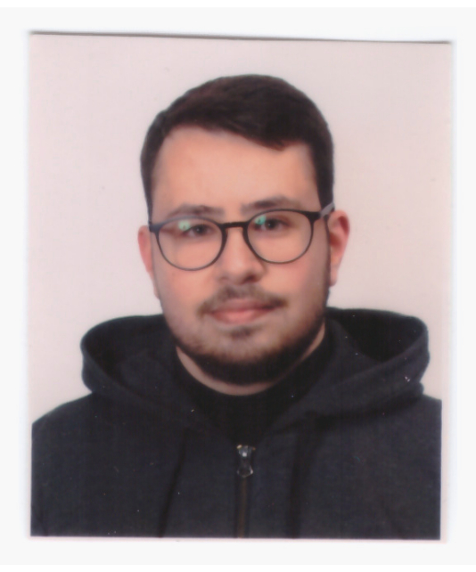

---
hide:
  - toc
  - navigation
---

  
  <h1>Gabriele Nicola Napoli</h1>
  
<strong>PhD Researcher</strong>

  
<em>Integrating geospatial data, geological risk assessment & Explainable AI (XAI)</em>

---

## About Me

I am a PhD researcher focusing on geological multi-risk assessment and geospatial data analysis. My research involves developing a virtual test-bed strategy that integrates natural process modeling with socioeconomic vulnerability data. I leverage open-source GIS tools, Google Earth Engine, and Python (including GeoPandas and machine learning libraries) to process complex spatial datasets like seismic PGA data and basin hydrology. I am particularly interested in applying Explainable AI (XAI) techniques, such as SHAP and Random Forests, to improve the interpretability of spatial risk models. Currently, I am advancing my academic research while preparing for future roles in education and academia.

  

---

[View My Projects :material-arrow-right:](projects/index.md){ .md-button .md-button--primary }
[Download CV :material-download:](assets/Gabriele-Nicola-Napoli-CV.pdf){ .md-button }

---

## Skills

-   :material-layers:{ .lg .middle } **Geospatial Analysis**

    ---

    - QGIS
    - Google Earth Engine (GEE)
    - Spatial data formats (Shapefiles, GeoPackages, Rasters, GeoTIFF)

-   :material-code-braces:{ .lg .middle } **Programming & Environments**

    ---

    - Python — GeoPandas, scikit-learn
    - Linux (Fedora) & Open-Source ecosystem (VSCodium)
    - Package management (DNF, Flatpak)

-   :material-star-four-points:{ .lg .middle } **Machine Learning & Risk Modeling**

    ---

    - Explainable AI (XAI) - SHAP
    - Random Forest models
    - Geological multi-risk assessment & Virtual Test-Beds
    - Data interpolation and spatial processing

---

## Connect

[GitHub](https://github.com/gabrielenapolinic){ .md-button }
[LinkedIn](https://www.linkedin.com/in/gabrielenicolanapoli){ .md-button }